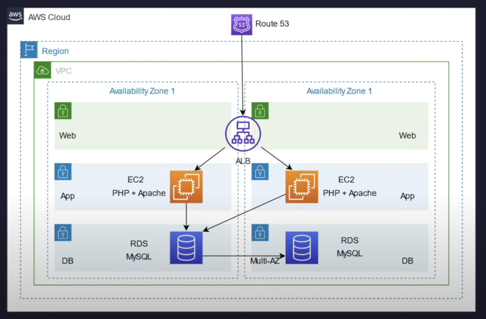

# AWS 3 Tier Architecture

## Architecture

## Services

- VPC

  - Subnets
  - NACLs
  - Security Groups
  - NAT gateways
  - Internet gateways

- EC2

  - Auto Scaling
  - Application Load Balancer

- RDS
