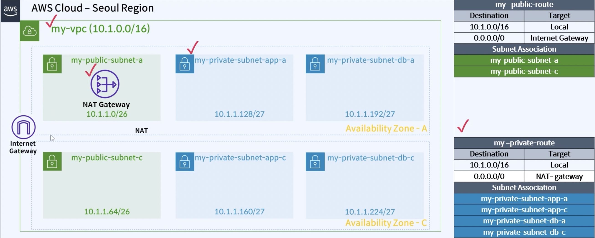

# AWS 3 Tier Architecture VPC

## 실행방법

```
  source alias.sh
  tf workspace new [mode]

  tf init && tf plan -var-file=tf.tfvars
  tf apply -var-file=tf.tfvars
```

## Architecture



## OpenVPN 설정

- OpenVPN을 사용하여 Private Subnet으로 접근한다


```
  ssh -i id_rsa openvpnas@public_ip
  https://public_ip:943/admin

  id : openvpn
  pw : ~~~~~~

  > user Management (host, Guest 지정)
```

## Caution

- ap-northeast-2의 경우 t3로 진행해야 함 (t2는 불가)
- t3.nano는 ssh provisioning이 안됨... 네트워크 불량? + 저사양? => t3.micro 이상으로 해야함
- EC2 에서 MarketPlace AMI는 구독을 해야 생성이 되네?
- openVPN EC2 접속할 때는 > ssh -i "" openvpnas@public_ip
